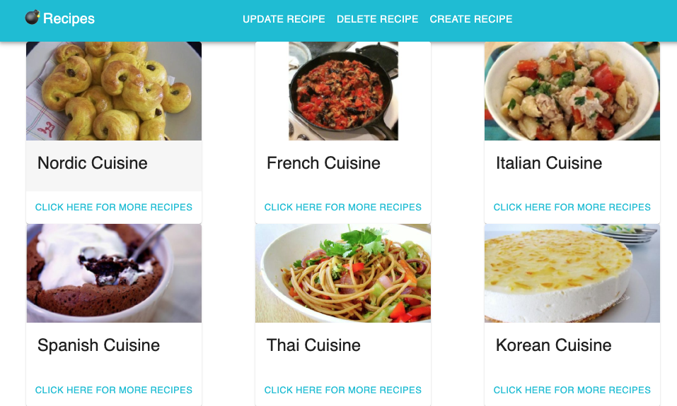

# Front End of JSON API Project
_______________________

## Deployed URL

https://5fb302f7aeb9ba00073d79d4--hungry-colden-771163.netlify.app/

## Sample 
***

## Descriptions
_________________

This front end site was built using the framework react in conjunction with some elements from material ui. This site gathers information from my deployed JSON API via heroku. It gather information from the database to populate a user friendly interface to read, update, delete, and create recipes. The user has CRUD functionality to change the informatin on the seeded heroku database.

__Development Process__

__Date__|__Progress__|__To Do__|
--------- | ------------| ----------|
11/6/2020 | Started creating react database and working on axios get commands to retrieve data| Add more Crud functionality|
11/7/2020 | Adding Create, update and delete functionality to change information in the database | Add display components for read home page|
11/8/2020 | Imported material UI components for styling on some pages | Stylize more |
11/9/2020 | Improved CRUD functionality via QA and added styling for displayed components on homepage. Added page for successful and unsuccessful CRUD changes. Added page for recipe detailed information via genra| details page needs more styling|
11/14/2020 | Updated CRUD Functinality so that the options are directly below the recipe elements. Made user experience easier| need to continue working on how elements are shown after they have been update. Potentially could change a value of all elements that have been edited and I could set an if else statement to recognize and filter that way. Or could change how db is seeded on backend project.

__API Used__
____________
- Deployed API used https://bombrecipeapi.herokuapp.com/  .  This was created as the first step to this project and pulled information from spoonacular api.
- Crud Functionality is able to change the deployed api not the local environment.

